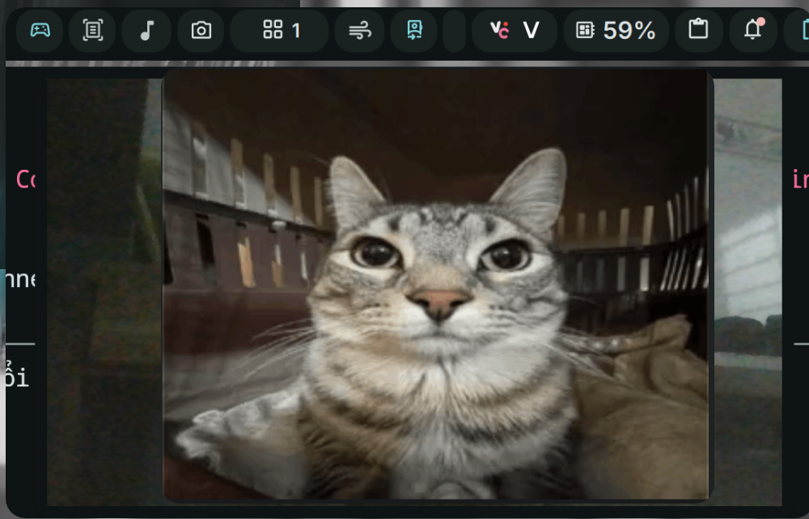

# DMS Hand Mirror

Cozy camera preview plugin for DankMaterialShell (DMS). Inspired by the macOS "Hand Mirror" app.



## Install

Use the DMS CLI:
```bash
dms plugins install handMirror
```

Or manually:
```bash
git clone https://github.com/hthienloc/dms-hand-mirror ~/.config/DankMaterialShell/plugins/handMirror
```

## Features

- **Camera Preview:** Instant camera check from the DankBar status pill.
- **Snapshot:** Capture frames with optional countdown delay (3s, 5s, 10s) and custom save directory.
- **Screen Flash:** Toggleable flash animation on snapshot.

### Bar Interactions

| Action | Result |
|--------|--------|
| **Left Click** | Toggle popout preview |
| **Right Click** | Open floating window (pin to desktop) |

### Popout Controls

- **Scroll Wheel:** Adjust digital zoom.
- **Left Drag:** Pan zoom focal position.
- **Snapshot button:** Capture with configured delay and save to configured directory.
- **Pin button:** Detach camera into a floating window.

### Floating Window Controls

- **Right Drag:** Pan zoom focal position.
- **Scroll Wheel:** Adjust digital zoom.

## Requirements

- DankMaterialShell >= 1.5

## TODO / Roadmap

- [ ] Interactive drawing / annotation on snapshots.
- [ ] Customizable pen color & brush width.
- [ ] Real-time microphone input peak level indicator.

## License

MIT
